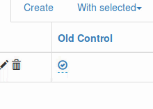
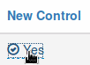

Flask-Admin-Toggle-Control
==========================

Better boolean toggle control for Flask-Admin inline form.

Better UX
---------

Replace this:

with this:

Installation
------------
::

    pip install flask-admin-toggle-control

Integrate
---------

Edit your view class to integrate toggle control:

1. Inherit from ViewMixin::

    class SomeView(flask_admin_toggle_control.ViewMixin, ModelView):
        pass

2. Define fields to show with toggle control::

    class SomeView(flask_admin_toggle_control.ViewMixin, ModelView):
        column_toggle_control_list = ["boolean_field1", "boolean_field2"]

3. Do not forget to have these fields editable::

    class SomeView(flask_admin_toggle_control.ViewMixin, ModelView):
        column_toggle_control_list = ["boolean_field1", "boolean_field2"]
        column_editable_list = ["boolean_field1", "boolean_field2", "other_editable_field"]

